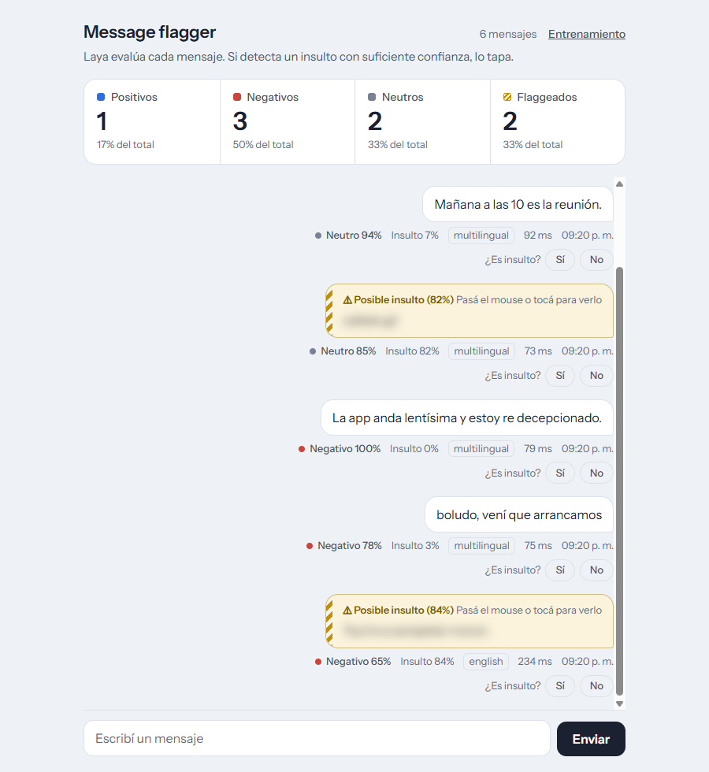
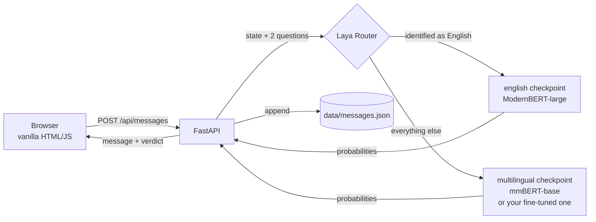
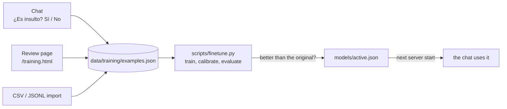
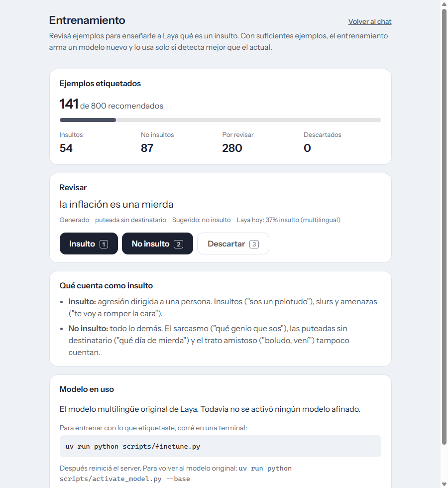

# Laya chat message classification

A tiny chat that runs every message through **[Laya](https://huggingface.co/convaiinnovations/laya)**, an open-source *decision model*, to:

- **flag insults**: a flagged message is blurred like a spoiler, and hovering or tapping reveals it;
- **classify sentiment** as positive, negative or neutral;
- **count it all** in live tiles at the top.

You can also **teach Laya your own definition of an insult** by labeling examples and fine-tuning it on your GPU.



> The UI is in Spanish (Rioplatense) because that is the language it was built to moderate.

---

## What makes Laya different

Laya is **not** a chatbot. It never writes text. You hand it a piece of text and a few *typed questions*, and it returns calibrated probabilities for every allowed answer in a single forward pass (~20–90 ms on a GPU). Nothing has to be parsed, and it cannot answer outside the options you gave it.

For each message the app asks two `choice` questions in one call:

| Question | Options | Used for |
|---|---|---|
| `insult` | `insult` / `clean` | flag the message when `P(insult) ≥ FLAG_THRESHOLD` (0.7) |
| `sentiment` | `positive` / `negative` / `neutral` | the sentiment chip and the tiles |

## How it works



- **Routing.** Laya ships two checkpoints. Its router picks one per message from the script and from function words. A lot of short Spanish never gets identified as Spanish, so the app sets `Router(default="multilingual")`: only text that Laya recognizes as English goes to the English checkpoint. Each message shows which checkpoint answered.
- **One process.** FastAPI serves the API and the static frontend, and loads both checkpoints at startup.
- **Storage.** Plain JSON files under `data/`, written atomically.

## Quick start

You need Python 3.11–3.13 and [uv](https://docs.astral.sh/uv/). An NVIDIA GPU is optional: without one it runs on CPU, more slowly.

```bash
uv sync
uv run uvicorn app.main:app --port 8080
```

Open <http://127.0.0.1:8080>. The first start downloads the two Laya checkpoints (~2.8 GB) into the Hugging Face cache. The server starts answering once they are loaded.

`torch` comes from PyTorch's CUDA 13.0 index (see `pyproject.toml`), because PyPI only has CPU builds for Windows.

| Variable | Default | What it does |
|---|---|---|
| `FLAG_THRESHOLD` | `0.7` | minimum `P(insult)` to blur a message |
| `LAYA_DEVICE` | auto | torch device (`cuda`, `cpu`) |

To try the model without the UI:

```bash
uv run python scripts/try_laya.py "callate gil" "no sos un idiota" "You're a moron"
```

## Teaching Laya (fine-tuning)

Out of the box Laya misses a lot of Rioplatense slang. It also gets confused by negations like *"no sos un idiota"* ("you're not an idiot"). Fine-tuning shows it hundreds of examples with the right answer and nudges its weights toward your definition of an insult. Then it gets tested on examples it never saw, and the new model is used **only if it beats the original**.



**1. Label examples.** There are three ways, and they all land in the same dataset:

- in the chat, with the *¿Es insulto? Sí / No* buttons under every message;
- on the review page, one pending example at a time, with keyboard shortcuts `1` insult, `2` not an insult, `3` discard;
- by importing a file: `uv run python scripts/import_examples.py file.csv` (a `text` column and an optional `label` column with `insult` or `clean`).

`datasets/generated_rioplatense_v1.jsonl` has **421 generated Rioplatense examples**, heavy on the hard cases: threats, negations, friendly *"boludo"*, sarcasm, swearing at no one. Import them for review with:

```bash
uv run python scripts/import_examples.py datasets/generated_rioplatense_v1.jsonl --source generated
```



**2. Train.**

```bash
uv run python scripts/finetune.py
```

It takes about 30 s for ~400 examples on an RTX 3080 Ti. The script works like this:

- **Splits.** Every example is assigned by a hash of its text to **train (70%)**, **calib (10%)** or **test (20%)**. The same sentence can never be both studied and examined.
- **Training.** It follows Laya's own fine-tuning recipe (cross-entropy plus the RLCD proper-scoring-rule term) on one GPU in bf16.
- **Keeping sentiment.** Only insults get labels, so every training text also carries the sentiment question with the *original* model's answer as target (distillation). That way sentiment doesn't drift.
- **Calibration.** It refits the temperatures on the calib split, so "84% sure" means something.
- **Activation.** It compares both models on the test split and **activates the new checkpoint only if** insult F1 improves, sentiment agrees with the original on ≥ 85% of messages, and there are at least 10 test examples of each class.

**3. Restart the server** to load the new checkpoint. To go back:

```bash
uv run python scripts/activate_model.py --list   # trained checkpoints (* = active)
uv run python scripts/activate_model.py --base   # back to Laya's original model
```

A preview run on the generated set, using its *suggested* labels without human review, so the numbers are optimistic:

| Test split (89 examples) | Original | Fine-tuned |
|---|---|---|
| Accuracy | 73% | 89% |
| Insults caught (recall) | 26% | 70% |
| Correct flags (precision) | 64% | 90% |
| F1 | 37% | 79% |
| Calibration error (lower is better) | 0.19 | 0.05 |

The step-by-step guide, including the labeling policy and how to read the report, is in [`docs/finetuning.md`](docs/finetuning.md) (in Spanish).

## Moderation benchmark

Before choosing a moderation model, `bench/` scores the candidates on one shared exam: Spanish, Portuguese and English messages labeled for insult, threat, identity hate, sexual harassment, profanity and target.
- **Sources:** HateCheck (es/pt/en), ToLD-Br and OLID-BR, plus a Rioplatense casino suite the team reviews (`suites/es_casino.csv`).
- **Contestants:** Laya zero-shot, the app's current Laya question, Detoxify multilingual and an mmBERT toxicity model. All are open-source and run locally; no paid or hosted APIs.

```bash
uv run python scripts/bench.py sources       # what the exam contains
uv run python scripts/bench.py run           # writes bench_out/scoreboard.md
uv run python scripts/bench.py latency --device cpu
```

Every model gets one operating threshold, set on a calibration split at 5% false positives. The report shows per-source AUROC with bootstrap confidence intervals, paired comparisons against the best model, and per-functionality accuracy. The labeling policy, the review guide and how to read the report are in [`docs/benchmark.md`](docs/benchmark.md) (in Spanish).

## Project layout

```
app/
  main.py          FastAPI app: chat, labeling and training endpoints, static files
  classifier.py    the questions sent to Laya, the flag rule, the Router setup
  examples.py      labeled-example store, deterministic splits, CSV/JSONL parsing
  checkpoints.py   which fine-tuned checkpoint is active
  store.py         chat message store
trainer/
  finetune.py      the training / calibration / evaluation loop
  metrics.py       F1, calibration error, the activation rule
  targets.py       labels → training targets
bench/             moderation benchmark: sources, contestants, metrics, report
suites/            the hand-written Spanish suite reviewers edit
scripts/           try_laya · import_examples · finetune · activate_model
static/            chat (index.html) and review page (training.html), no build step
datasets/          generated examples to review
tests/             pytest suite
```

## API

| Method | Path | |
|---|---|---|
| `GET` | `/api/messages` | chat history, with each message's label if any |
| `POST` | `/api/messages` | `{"text"}` → classify, store, return the message |
| `POST` | `/api/messages/{id}/label` | `{"label": "insult" \| "clean"}` |
| `GET` | `/api/stats` | counts for the tiles |
| `GET` | `/api/training/summary` | labeling progress and the model in use |
| `GET` | `/api/training/next` | next pending example, with Laya's current guess |
| `POST` | `/api/training/examples/{id}/label` | `{"label": "insult" \| "clean" \| "discard"}` |

## Tests

```bash
uv run pytest            # fast suite, no model needed
uv run pytest -m slow    # end-to-end fine-tuning on the real checkpoint (~15 s on GPU)
```

## Known limitations

- **Calibration.** The base checkpoints are overconfident, and `laya-multilingual` ships with no calibration at all. Treat `FLAG_THRESHOLD` as a knob, not a truth.
- **Negations.** The base model flags *"no sos un idiota"* (`P(insult)` 0.80). That is one of the things fine-tuning is meant to fix.
- **Version pin.** The trainer relies on Laya's private encoding and calibration APIs, so `laya` is pinned to `0.3.22`.
- **Question wording.** A fine-tuned checkpoint is tied to the exact question wording it was trained with. The server warns at startup if `QUESTIONS` changed since.

## Credits

[Laya](https://github.com/NandhaKishorM/laya) by Convai Innovations, Apache-2.0.
